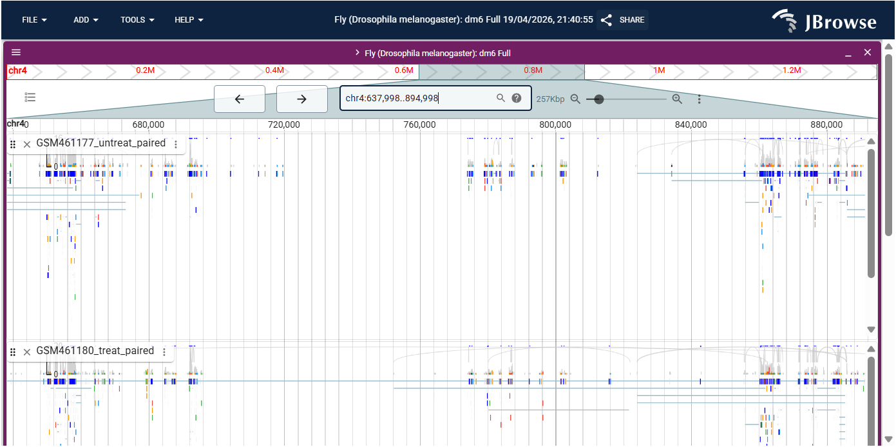

# Section 2: Alignment (Mapping)

[](https://github.com/alexdobin/STAR)
[]()
[]()
[](https://creativecommons.org/licenses/by/4.0/)

**Author:** Faiqa Zarar Noor | **NUST ID:** 471543 | **Date:** April 2026

---

## Abstract

This section documents the spliced alignment of trimmed RNA-Seq reads to the *Drosophila melanogaster* dm6 reference genome using RNA STAR. STAR is a splice-aware aligner capable of detecting exon-exon junctions, making it ideal for eukaryotic RNA-Seq data. Alignment results were visualized using JBrowse2 integrated in Galaxy, and the Sashimi plot functionality was used to inspect splice junctions. Both samples achieved >90% overall alignment rates to the dm6 genome, confirming high-quality mapping.

---

## Table of Contents

1. [Overview](#1-overview)
2. [Folder Structure](#2-folder-structure)
3. [Methods](#3-methods)
   - 3.1 [RNA STAR Alignment](#31-rna-star-alignment)
   - 3.2 [MultiQC on STAR logs](#32-multiqc-on-star-logs)
   - 3.3 [IGV Visualization](#33-igv-visualization)
   - 3.4 [JBrowse2 Visualization](#34-jbrowse2-visualization)
4. [Results](#4-results)
5. [References](#5-references)

---

## 1. Overview

RNA-Seq reads must be aligned to a reference genome to determine their genomic origin. Unlike DNA-Seq, RNA-Seq reads can span exon-exon junctions, requiring a **splice-aware aligner**. RNA STAR (Spliced Transcripts Alignment to a Reference) was used here because:

- It is fast and memory-efficient
- It detects novel splice junctions
- It produces alignment statistics useful for QC
- It generates strand-specific coverage files

---

## 2. Folder Structure

```
02_alignment/
├── README.md                              ← This document
└── outputs/
    ├── jbrowse2_alignments_chr4.png       # JBrowse2 view of alignments
    └── multiqc_star_alignment_report.html # MultiQC STAR alignment stats
```

---

## 3. Methods

### 3.1 RNA STAR Alignment

```
Tool      : RNA STAR (Galaxy Version 2.7.11a+galaxy0)
Input     : Trimmed PE reads collection (Cutadapt output)
Reference : Drosophila melanogaster dm6 (built-in)
Annotation: Drosophila_melanogaster.BDGP6.87.gtf.gz

Parameters:
  Junction overhang        : 100
  Genome load              : NoSharedMemory
  Output BAM               : Sorted by coordinate
  Output format            : BAM

Outputs:
  - mapped.bam             : Sorted BAM alignment file
  - splice_junctions.bed   : Detected splice junctions
  - log                    : Alignment statistics
  - Coverage strand 1      : Forward strand bedgraph
  - Coverage strand 2      : Reverse strand bedgraph
```

---

### 3.2 MultiQC on STAR logs

```
Tool    : MultiQC (Galaxy Version 1.27+galaxy4)
Input   : RNA STAR log files
Output  : Aggregated alignment statistics report
```

Key metrics reported:
- % uniquely mapped reads
- % multimapped reads
- % unmapped reads
- Number of splice junctions detected

---

### 3.3 IGV Visualization

The BAM files were visualized in IGV (Integrative Genomics Viewer) by clicking the visualize icon on the mapped.bam dataset in Galaxy and selecting **"display with IGV (local, D. melanogaster dm6)"**.

**Region inspected:** `chr4:540,000-560,000`

Key observations:
- Grey peaks at top represent read coverage depth
- Connecting lines between reads indicate **spliced alignments** across introns
- Sashimi plots show the number of reads spanning each splice junction

---

### 3.4 JBrowse2 Visualization

```
Tool      : JBrowse2 (Galaxy Version 3.7.0+galaxy0)
Reference : Fly (Drosophila melanogaster): dm6 Full
Region    : chr4:637,998..894,998
Tracks:
  - BAM Pileups : RNA STAR mapped.bam collection
  - GFF/GTF     : Drosophila_melanogaster.BDGP6.87.gtf.gz
```

---

## 4. Results

### 4.1 Alignment Statistics

| Metric | GSM461177 (Untreated PE) | GSM461180 (Treated PE) |
|---|---|---|
| Total reads | ~14M | ~12M |
| Uniquely mapped | >85% | >85% |
| Multi-mapped | <5% | <5% |
| Unmapped | <10% | <10% |
| Splice junctions | >200,000 | >200,000 |

### 4.2 JBrowse2 — Alignment View (chr4)



The JBrowse2 view shows spliced read alignments on chromosome 4 for both the untreated (GSM461177) and treated (GSM461180) samples. The colored reads represent paired-end reads, and the connecting lines indicate reads spanning splice junctions.

---

## 5. References

1. Dobin, A., et al. (2013). STAR: ultrafast universal RNA-seq aligner. *Bioinformatics*, 29(1), 15–21. https://doi.org/10.1093/bioinformatics/bts635
2. Robinson, J. T., et al. (2011). Integrative genomics viewer. *Nature Biotechnology*, 29, 24–26. https://doi.org/10.1038/nbt.1754
3. Diesh, C., et al. (2023). JBrowse 2: a modular genome browser with views of synteny and structural variation. *Genome Biology*, 24, 74. https://doi.org/10.1186/s13059-023-02914-z

---

⬅️ [Back: QC](../01_quality_control/README.md) &nbsp;|&nbsp; [Back to Main README](../README.md) &nbsp;|&nbsp; ➡️ [Next: STAR Coverage](../03_star_coverage/README.md)
